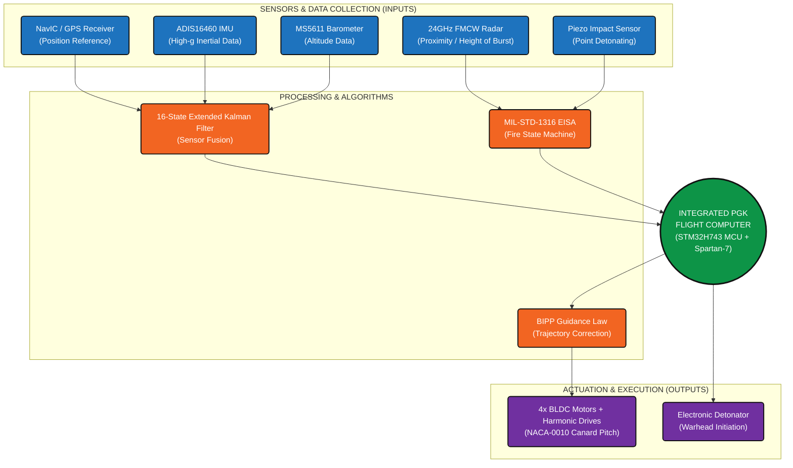

```mermaid
graph TD
    %% Styling
    classDef hardware fill:#1e73be,stroke:#111,stroke-width:2px,color:#fff,rx:5px;
    classDef software fill:#f26522,stroke:#111,stroke-width:2px,color:#fff,rx:5px;
    classDef core fill:#0d9447,stroke:#111,stroke-width:3px,color:#fff,rx:10px;
    classDef output fill:#7030a0,stroke:#111,stroke-width:2px,color:#fff,rx:5px;

    %% Core System
    CORE(("INTEGRATED PGK<br>FLIGHT COMPUTER<br>(STM32H743 MCU + Spartan-7)")):::core

    %% Sensors (Inputs)
    subgraph Sensors ["SENSORS & DATA COLLECTION (INPUTS)"]
        GPS["NavIC / GPS Receiver<br>(Position Reference)"]:::hardware
        IMU["ADIS16460 IMU<br>(High-g Inertial Data)"]:::hardware
        RADAR["24GHz FMCW Radar<br>(Proximity / Height of Burst)"]:::hardware
        BARO["MS5611 Barometer<br>(Altitude Data)"]:::hardware
        PIEZO["Piezo Impact Sensor<br>(Point Detonating)"]:::hardware
    end

    %% Software Algorithms
    subgraph Processing ["PROCESSING & ALGORITHMS"]
        EKF["16-State Extended Kalman Filter<br>(Sensor Fusion)"]:::software
        BIPP["BIPP Guidance Law<br>(Trajectory Correction)"]:::software
        FSM["MIL-STD-1316 EISA<br>(Fire State Machine)"]:::software
    end

    %% Outputs
    subgraph Outputs ["ACTUATION & EXECUTION (OUTPUTS)"]
        CANARDS["4x BLDC Motors + Harmonic Drives<br>(NACA-0010 Canard Pitch)"]:::output
        DETONATOR["Electronic Detonator<br>(Warhead Initiation)"]:::output
    end

    %% Connections
    GPS --> EKF
    IMU --> EKF
    BARO --> EKF
    
    RADAR --> FSM
    PIEZO --> FSM

    EKF --> CORE
    FSM --> CORE
    CORE --> BIPP
    
    BIPP --> CANARDS
    CORE --> DETONATOR
```
